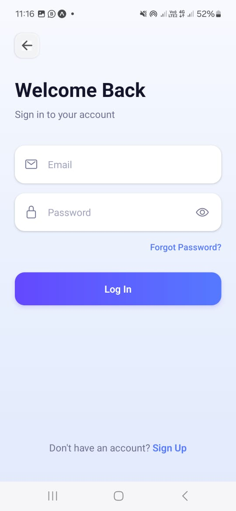
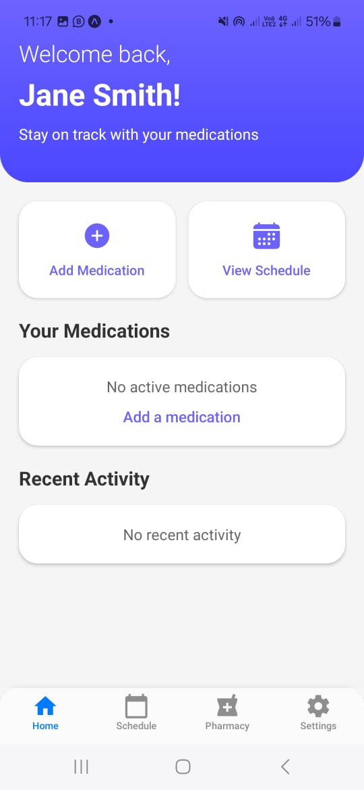
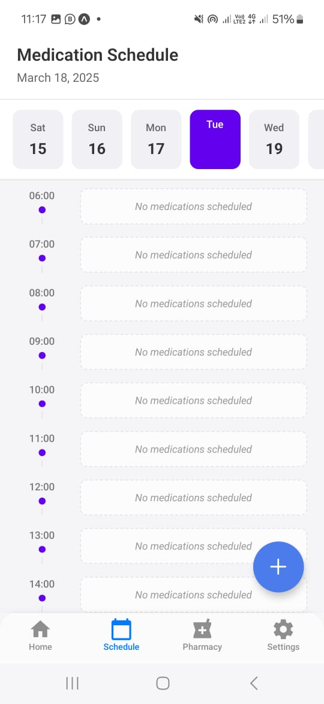
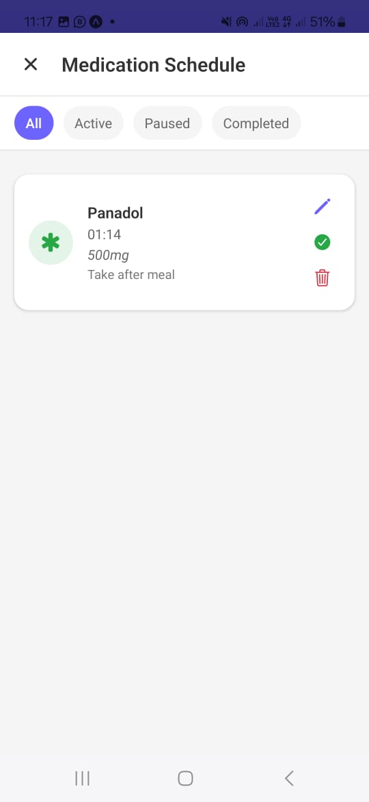
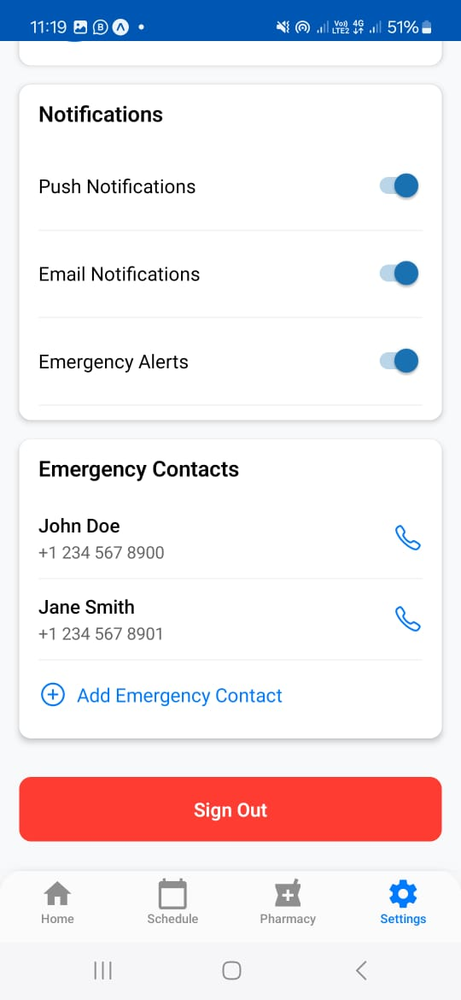

# MedicationApp

A mobile application to help users manage their medications, find pharmacies, and maintain their medication schedule.

## Features

- User Authentication (Login/Signup)
- Medication Management
- Pharmacy Locator
- Schedule Management
- Settings Customization

## Screenshots

### Welcome & Authentication




### Core Features





### Additional Features



## Project Structure

```
app/
  ├── _layout.tsx
  ├── (auth)/
  │   ├── welcome.tsx
  │   ├── login.tsx
  │   └── signup.tsx
  └── (tabs)/
      ├── _layout.tsx
      └── index.tsx
```

## Tech Stack

- Frontend: React Native with Expo
- Backend: Node.js
- Database: SQL

## Getting Started

### Prerequisites
- Node.js
- npm or yarn
- Expo CLI

### Installation

1. Clone the repository
```bash
git clone [repository-url]
```

2. Install frontend dependencies
```bash
cd Medication_app
npm install
```

3. Install backend dependencies
```bash
cd Backend
npm install
```

4. Set up environment variables
- Create a `.env` file in the Backend directory
- Add necessary environment variables

### Running the App

1. Start the backend server
```bash
cd Backend
npm start
```

2. Start the Expo app
```bash
cd Medication_app
npx expo start
```

## Contributing

1. Fork the repository
2. Create your feature branch
3. Commit your changes
4. Push to the branch
5. Open a Pull Request